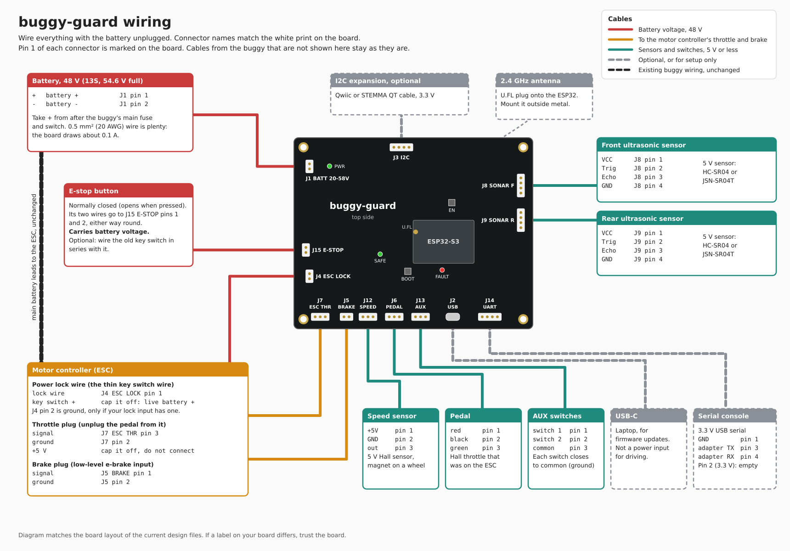

# Installing buggy-guard

buggy-guard sits between the pedal and the motor controller (ESC). The pedal plugs into the
board, the board drives the ESC's throttle, brake and power lock, and the battery's main leads
to the ESC stay as they are.

## Before you start

- The board is built for a 48 V pack (13S, 54.6 V fully charged). It starts at about 20 V.
  Do not use a 14S pack.
- Unplug the battery before connecting anything.
- The brake output only works with a low-level e-brake input: one where the brake lever
  shorts the brake wire to ground. ESCs with a 12 V high-level brake input need a different
  driver.
- You need a multimeter, JST XH crimp housings (2.5 mm) for the small connectors, and a
  normally closed e-stop button.

## Connectors

The names match the white print on the board. Pin 1 is marked next to each connector.

| Connector | Pin 1 | Pin 2 | Pin 3 | Pin 4 |
|---|---|---|---|---|
| J1 BATT 20-58V (screw terminal) | battery + | battery - | | |
| J15 E-STOP (JST XH) | e-stop button | e-stop button | | |
| J4 ESC LOCK (screw terminal) | ESC power lock wire | ground, usually empty | | |
| J7 ESC THR (JST XH) | empty | ESC throttle ground | ESC throttle signal | |
| J5 BRAKE (JST XH) | ESC brake signal | ESC brake ground | | |
| J6 PEDAL (JST XH) | pedal red (+5 V) | pedal black | pedal green (signal) | |
| J12 SPEED (JST XH) | sensor +5 V | sensor ground | sensor output | |
| J13 AUX (JST XH) | switch 1 | switch 2 | common (ground) | |
| J8 SONAR F (JST XH) | VCC | Trig | Echo | GND |
| J9 SONAR R (JST XH) | VCC | Trig | Echo | GND |
| J14 UART (JST XH) | GND | 3.3 V out, leave empty | adapter TX | adapter RX |
| J3 I2C (Qwiic) | GND | 3.3 V | SDA | SCL |

Pedal wire colours vary between makers. If yours differ, find +5 V and ground with a meter on
the ESC's throttle plug before you unplug the pedal.

## Step by step

1. **Mount the board.** Four M3 holes, 92 x 72 mm apart. Put it in a box out of the rain, away
   from the motor phase wires.
2. **Battery.** Run two wires to J1 from the ESC's own battery terminals, not from the battery.
   The board's ground also reaches the ESC through the throttle and brake plugs, so if J1 pin 2
   went to the battery instead, motor current would share the thin signal grounds and offset
   the throttle. Taking + at the ESC also puts it after the buggy's main fuse and switch.
   0.5 mm² (20 AWG) wire is enough; the board draws about 0.1 A.
3. **Power lock.** Most ESCs have a key switch with two wires: a thick one that is always at
   battery voltage, and a thin lock wire that turns the ESC on. Find them with the meter: with
   the battery connected and the key off, the lock wire reads 0 V. Unplug the battery again,
   cut the key switch out, connect the lock wire to J4 pin 1, and insulate the other wire well.
   It is live battery + whenever the battery is connected.
4. **E-stop.** Wire a normally closed e-stop button to J15, either way round. It carries
   battery voltage. If you want to keep the old key switch, wire it in series with the e-stop.
5. **Pedal and throttle.** Unplug the pedal from the ESC and plug it into J6. Wire the ESC's
   throttle plug to J7: signal to pin 3, ground to pin 2. Leave the ESC's throttle +5 V wire
   unconnected and insulated.
6. **Brake.** Wire the ESC's brake plug to J5: signal to pin 1, ground to pin 2.
7. **Ultrasonic sensors.** A 5 V HC-SR04 or JSN-SR04T on J8 (front) and J9 (rear). Their pin
   order is the same as the connector, so a straight cable works.
8. **Speed sensor.** A 5 V Hall sensor on J12, with a magnet on a wheel. J8, J9 and J12 share a
   200 mA supply.
9. **AUX switches** (optional). Each switch goes from J13 pin 1 or pin 2 to pin 3. What they do
   is set in the firmware.
10. **Antenna.** Clip a 2.4 GHz U.FL antenna onto the socket on the ESP32 module. Mount the
    antenna outside any metal and away from the motor and battery wires.

USB-C is for loading firmware from a laptop. It does not power the buggy for driving.

## Fardriver ND72240

The ND72240 is a 72 V series controller, so a few settings have to change for a 48 V pack and
for the board's throttle. Wire colours and pin numbers are from the Fardriver manual's 30-pin
table; check them against the label on your harness.

| ND72240 wire | Colour | 30-pin | Goes to |
|---|---|---|---|
| Electric key lock (KEY) | orange | 11 | J4 ESC LOCK pin 1 |
| Throttle signal (SV) | green and white | 14 | J7 ESC THR pin 3 |
| Throttle ground | black | 24 | J7 pin 2 |
| Throttle power (ACC+) | red and white | 23 | not connected, insulate it |
| Low brake (BL) | yellow and green | 20 | J5 BRAKE pin 1 |
| Low brake ground | black | 18 | J5 pin 2 |
| High brake (BH) | grey | 19 | not connected |
| Anti-theft power + | pink and red | 2 | not connected |

Leave the anti-theft power wire unconnected. The key lock must be the only thing that can turn
the controller on, or the board cannot switch it off.

In the Fardriver app:

- **Rated voltage** 48 V, and **undervoltage** to suit a 13S pack, about 42 V. A 72 V series
  controller ships with a 63 V undervoltage point and will not drive on a 48 V pack.
- **Throttle low threshold** 0.5 V. The board idles the throttle at 0 V.
- **Throttle high threshold** 4.0 V. The controller treats anything above the high threshold
  plus 0.6 V as a broken throttle, and the board's firmware caps its output at 4.2 V.
- **Low brake** set to "hanging driving and GND parking": drive while the wire floats, brake
  when it is grounded. The other setting inverts it, and the brake would stay on.
- **Gear mode** "default forward", unless you wire your own forward and reverse switch to the
  controller's FW and RE wires.
- If the controller reports a throttle fault whenever the board is disarmed, turn **lost
  throttle alarm** off. The board holds the throttle at 0 V when it is not armed.

The ND72240 only runs while the board is armed. When the board trips or the e-stop opens, the
controller loses power and cannot regen brake, so the buggy coasts. Make sure its mechanical
brakes work.

## First power-up

Lift the driven wheels off the ground first.

1. Connect the battery. The green PWR LED comes on. The green SAFE LED stays off, and the ESC
   stays off: with a Fardriver, the app cannot find it over Bluetooth.
2. Press the pedal. The motor must not turn: the board holds the throttle at zero and the
   brake on until the firmware arms it.
3. Press the e-stop. The ESC must switch off. Release it.
4. Arm the board from the remote. SAFE comes on, and the pedal now drives the motor.
5. Take the remote out of range, or press the e-stop, and check the motor stops.

If the ESC does not switch on through J4, measure the current its lock wire draws through the
old key switch. It should be under 0.3 A. Some ESCs charge a capacitor through it; the board's
1 A fuse also feeds the board itself.
