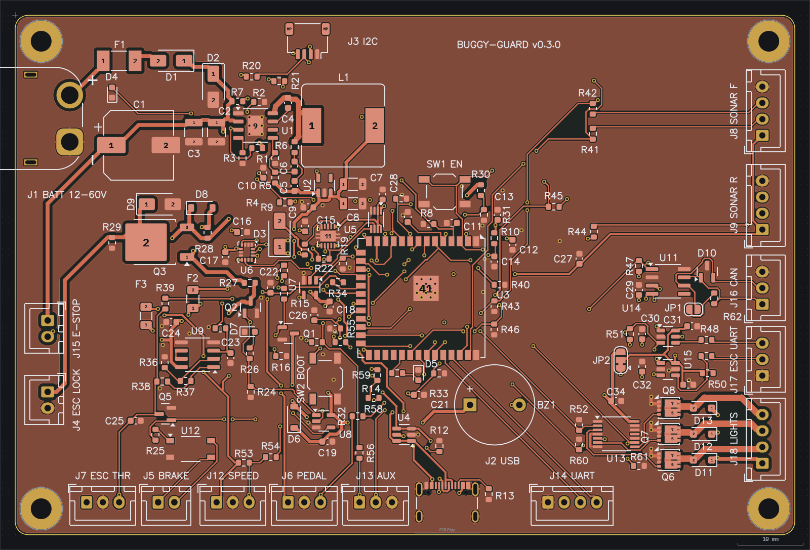
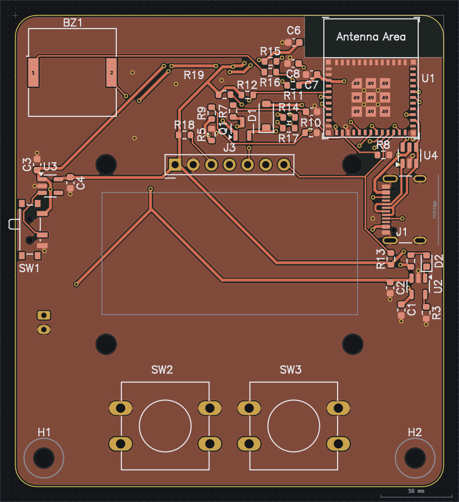
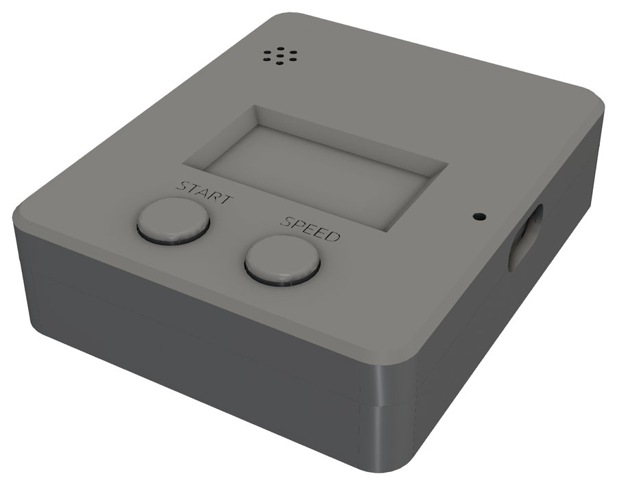

# buggy-guard

A safety and vehicle controller for small electric vehicles: scooters, kids buggies and ride-on
cars on a 12 to 60 V pack (3S to 16S, 67.2 V fully charged) with an off-the-shelf ESC. It sits
between the throttle and the ESC and never lets the throttle alone drive the motor: the ESP32-S3
must keep feeding a hardware window watchdog, the IMU must not have latched an impact, and the
remote fob must be in range, before a throttle signal reaches the controller. Three independent
hardware paths can cut power, so a hung MCU, a dead MCU or a dead radio all stop the vehicle.

Around that it carries what a vehicle controller needs: an isolated brake contact that works with
low and high level brake inputs, CAN and a UART to talk to the ESC (VESC, Fardriver, Kelly), and
three 2 A low-side outputs for lights and a horn.

The schematic is split into five sheets (`buggy-guard.sch.toml` lists `power`, `mcu`, `safety`,
`io`, `vehicle`), the layout is `buggy-guard.pcb.toml`, and the board spec is
`buggy-guard.board.toml`. `agentee check` is clean.

## Circuit

### Power chain

| stage | part | notes |
|---|---|---|
| battery in | J1, F1 (1 A), D1 (reverse), D2 (SMAJ64A TVS), C1/C2/C3 | D2 stands off 64 V and breaks down at 71.1 V minimum, above a full 16S pack's 67.2 V. It clamps at 103 V at its full 3.9 A rated pulse, against the LM5164's 100 V absolute maximum; C1 and the pack's own impedance keep a real transient well short of that current |
| buck | U1 LM5164DDA, 47 uH, RON 41.2k (300 kHz), RFB 100k/31.6k | Starts at 9.0 V and stops at 8.4 V (UVLO divider R1 1M, R2 200k), so a 3S pack runs to empty. Ripple injection type 3: R6 180k, C5 3.3 nF, C6 330 pF gives 12.5 mV at FB at 9 V and 26 mV at 67 V; the LM5164 wants 12 mV at minimum input |
| LDO | U2 AP2112K-3.3, C9/C10 | 3V3 for the ESP32, IMU and gates |
| USB | J2, U4 USBLC6, R12/R13 5.1k, D3 SS14 | USB-C for flashing only; VBUS is ORed into +5V through D3 so it cannot drive the battery |

Peak input current is about 0.1 A at 48 V (WiFi bursts) and 0.4 A at 9 V, inside the fuse.
VBAT_ADC and ESTOP_ADC divide by 23 (220k over 10k), so a full 16S pack reads 2.92 V.

### Throttle path

J6 PEDAL is a Hall throttle (a pedal, a thumb or twist grip) on its own 5 V through F2 (100 mA
PTC). The signal goes to the ADC through a 10k/15k divider (0.6 x, 5 V reads 3.0 V). The throttle the ESC sees is generated, not
passed through: THR_PWM goes through a two-pole 20 kHz filter (R34/R35 10k, C22/C23 100 nF) into
an MCP6002 gain-of-1.5 stage (R36 20k, R37 10k). The op-amp output goes to
J7 ESC_THR through 470 R; the divider R39/R40 takes it back to an ADC so the firmware can see
what the ESC sees. Q5 (2N7002) shorts the throttle output to ground whenever KILL is high, so a
stuck PWM or a hung output stage still lands on zero throttle.

### Safety logic

```
WD_LATCH = cleared while WDOK is low, set on an ARM rising edge
SAFE = ARM AND WD_LATCH
KILL = NOT (SAFE AND BRK_REL)
```

BRK_REL is active high: R23 holds it low, so the brake is applied and the throttle shunted
until the firmware drives it high.

| net | from | to |
|---|---|---|
| WDOK | TPS3430 WDO (open-drain, 10k pull-up), LSM6DSO INT1 through R19 1k | U10 74LVC1G74 CLR, ESP32-S3 IO18 |
| WD_LATCH | U10 Q (D and PRE tied to +3V3) | U7 pin 2 |
| ARM | ESP32-S3 IO15, 100k pull-down R22 | U7 pin 1, U10 CLK |
| SAFE | U7 out, 100k pull-down R24 | U8 NAND pin 1, Q2 gate, green LED D7 |
| KILL | U8 out | U12 LED through R25 680R (brake contact), Q5 gate (throttle shunt) |
| IGN_G | Q2 (DMN10H220L) drain | Q3 IRFR9120N gate via R27 68k, D8 BZT52C15 clamp, R28 150k to source |

Q3 switches the ESC's power-lock wire, J4.1 (IGN_OUT). Its source is fed from VIN through the
normally closed e-stop loop on J15 (J15.1 VIN, J15.2 ESTOP_RET): opening it floats the Q3 source, R28 pulls the gate up and the lock drops. The
firmware sees the e-stop as a divider R30/R31 on ESTOP_ADC.

R27 and R28 give Q3 6.2 V of gate drive at 9 V, enough for the 0.3 A lock current. From 21.8 V
up D8 holds the gate at 15 V; at 67 V R27 drops 52 V and dissipates 40 mW, and D8 carries 0.7 mA.

### Brake contact

KILL lights the LED of U12, a TLP175A photorelay, through R25. Its MOSFET output is J5: two
isolated contacts, 60 V and 100 mA, 50 ohm worst case, either polarity. Wired across the
brake lever switch it works with both kinds of ESC brake input. A low level input has J5.1 on the
brake wire and J5.2 on the brake ground, a high level input has J5.2 on the ESC's brake supply
(5 or 12 V) instead. U8 drives 5.5 mA into the LED; the TLP175A needs 1 mA. Unpowered, the
contact is open and the brake is released, as before.

This replaces the 2N7002 (Q4) that pulled the brake wire to board ground, which only fitted a
low level input.

### CAN and ESC UART

U11 SN65HVD230 is a 3.3 V CAN transceiver on the ESP32-S3's TWAI controller (IO47 TX, IO48 RX),
Rs to ground for full speed. R47 holds TXD recessive while the ESP boots. D10 NUP2105L clamps
CANH and CANL. R62 120R is the bus terminator, connected by bridging solder jumper JP1, which
ships open. J16 is CANH, CANL, GND.

The ESC UART on J17 goes through two SN74LVC1T45 translators: U14 drives TX out (IO41), U15
brings RX in (IO42). Their B side runs from VIO, which solder jumper JP2 takes from +3V3 (1-2,
as made) or +5V (cut 1-2, bridge 2-3). R51 and R50 keep both lines idle high with nothing
attached; R48 and R49 (100R) limit current into a powered-down ESC. It is full duplex only; a
Ninebot style single wire bus needs its TX and RX joined at the cable.

### Light outputs

Three low-side switches for lamps and a horn. IO3, IO46 and IO45 go through U13 74AHCT125 on
+5V, so Q6-Q8 (DMT10H015LFG, 100 V, 23.5 mohm at 4.5 V) get a full 5 V gate. R52, R60 and R61
(100k) hold the buffer inputs low, which also keeps the IO45 and IO46 straps low at reset; IO45
high would select 1.8 V flash. J18 is LOAD+, OUT1, OUT2, OUT3: each load goes from LOAD+ to its
OUT, and D11-D13 (MBR1H100SF) clamp its flyback to LOAD+. LOAD+ can be any supply up to 60 V
that shares the battery negative, usually the battery itself or a 12 V converter. 2 A per
output; at that current a FET dissipates 94 mW. The load current returns through the board's
ground to J1.

The TPS3430 runs with SET0 = 0, SET1 = 1, CWD = 10k pull-up, which gives a guaranteed window of
10.35 ms (tWDL max) to 165.8 ms (tWDU min). The ESP must give WDI (IO17) a falling edge about
every 100 ms. A firmware
hang, an infinite loop with interrupts off, or a crashed task stops WDOK within 165 ms. WDO only
holds low for tRST (200 ms, CRST open) and then lets go, and a hung ESP still holds ARM high and
keeps LEDC running THR_PWM, so U10 latches the fault: once WDOK has gone low, SAFE stays low until
the firmware drives ARM low and high again with WDOK high. The watchdog never resets the ESP: it only drops SAFE, so flashing over USB is not disturbed. The IMU
is configured with INT1 as an open-drain, active-low, latched wake-up interrupt (PP_OD and
H_LACTIVE set in CTRL3_C, LIR set in TAP_CFG). INT1 powers up as a push-pull output driven low,
so WDOK sits at about 0.3 V through R19 until the firmware has done this. On an impact
above the threshold it pulls WDOK low itself and the throttle is dead before the firmware even
sees it. The kill is latched in firmware until the pedal is at zero and the fob resets.

## Parts

| ref | value | part |
|---|---|---|
| U1 | LM5164 | TI LM5164DDAT, the 250 piece reel; Mouser has none of the 2500 piece LM5164DDAR |
| U2 | AP2112K-3.3 | Diodes AP2112K-3.3TRG1 |
| U3 | ESP32-S3-WROOM-1U-N16R8 | 16 MB flash, 8 MB PSRAM. The -1U has a U.FL socket on the module and no PCB antenna |
| U5 | TPS3430 | TI TPS3430WDRCR, window watchdog with a separate WDO |
| U6 | LSM6DSO | ST LSM6DSOTR, 16 g accelerometer for the impact latch. Pin-compatible with the LSM6DS3TR-C first picked (pins 10/11 left open), which Farnell does not stock; its registers differ, WHO_AM_I is 0x6C |
| U7, U8 | 74AHCT1G08, 74AHCT1G00 | AHCT so 3.3 V is a valid high |
| U10 | 74LVC1G74 | TI SN74LVC1G74DCUR, on +3V3, latches a WDOK fault until ARM is re-asserted |
| U9 | MCP6002T | throttle filter amplifier, unit B unused (tied as a grounded follower) |
| U11 | SN65HVD230 | TI SN65HVD230DR, 3.3 V CAN transceiver |
| U12 | TLP175A | Toshiba TLP175A(TPL,E, 60 V 100 mA photorelay, 1 mA trigger |
| U13 | 74AHCT125 | TI SN74AHCT125PWR, gate buffer for the light outputs |
| U14, U15 | SN74LVC1T45 | TI SN74LVC1T45DBVR, ESC UART level translators |
| Q2 | DMN10H220L | ignition low-side driver, 100 V |
| Q3 | IRFR9120N | ignition power-lock switch, 100 V PFET in DPAK |
| Q5 | 2N7002 | throttle shunt |
| Q6-Q8 | DMT10H015LFG | Diodes DMT10H015LFG-7, light output switches, 100 V in PowerDI3333-8. The symbol is KiCad's DMT6008LFG with the second drain pad (7) added |
| D2 | SMAJ64A | 64 V standoff TVS |
| D10 | NUP2105L | onsemi NUP2105LT1G, CAN bus clamp |
| D11-D13 | MBR1H100SF | onsemi MBR1H100SFT3G, 100 V 1 A flyback diodes |
| JP1, JP2 | solder jumpers | copper only, `assembly = "no"` keeps them off the BOM |
| F1 | 0451 series 1 A | Littelfuse 0451001.MRL |
| F2, F3 | MF-NSMF010/30X-2, MF-NSMF020-2 | Bourns 1206 resettable PTCs for the pedal and sensor 5 V |
| BZ1 | 12x9.5 mm magnetic 5 V | Same Sky CEM-1205-IC, 7.6 mm pitch. It has its own 2.4 kHz driver, so the firmware switches BUZZ on and off and never sends it a tone. The CUI CEM-1205C first picked is discontinued |
| C1 | 47 uF 100 V | Nichicon UUX2A470MNL1GS, 10 x 10 mm SMD |
| Q1 | DMN3404L | Diodes DMN3404L-7, buzzer low-side switch, 82 mohm at 3 V gate; same SOT-23 pinout as the AO3400A |
| J2 | USB-C | GCT USB4105-GF-A, 16 pin USB 2.0, Mouser. KiCad's footprint, with its B1/B4/B9/B12 pads dropped (they lie on A12/A9/A4/A1 and the symbol has no such pins) and A1/A12 0.02 mm shorter at the inner end, so they clear the NPTH pegs by 0.2 mm |

Every part carries `mfr` and `mpn` fields. `agentee parts buggy-guard --boards N --spares --order
docs/` (and the same for `pendant`) prices every line at Mouser and Farnell and writes
`docs/NAME-order.csv` with the site each line is bought from, plus `docs/NAME-mouser.csv` (Mouser's
BOM import layout) and `docs/NAME-farnell.csv`. Each site sheet has the lines to order there on top,
then the lines bought at the other site, then the lines that site lacks, so order the top block on
each site. `--spares` rounds 0603 resistors and capacitors up to 10 and adds a spare to each
diode, transistor, IC and fuse line; the radio modules carry `spares = "0"`. The U.FL antenna and
the XH housings and crimps come from `buy_with` fields on U3 and the XH headers.

Every line is stocked at Mouser or Farnell (`agentee parts buggy-guard` checks both), most at
both. The Murata GRM188/GRM31/GRM32 capacitors first picked are End of Life or Obsolete at Mouser;
they are Kemet C0603C (X7R 50 V and X5R), Samsung CL31 and Kemet C1210 parts of the same value,
package, voltage and dielectric now. The 10 uF 0603 is a 20% part (C0603C106M8PACTU), the only one
both distributors stock; a 10% one is TDK C1608X5R1A106K080AC at Mouser only.

## Board

`buggy-guard.board.toml`: 120 x 80 mm, JLC04161H-7628 4 layer, ENIG, black mask.



- F.Cu and B.Cu carry signals and power, In1.Cu is a solid ground plane, In2.Cu is a +3V3 plane.
  Every net class is confined to F.Cu/B.Cu (plus In2 for signals), so In1 is never routed through.
- HV class (battery, ignition, e-stop loop, LOAD+) is 0.6 mm with 0.5 mm clearance, on the outer
  layers only. Load class (OUT1-OUT3) is 1 mm for 2 A at a 10 C rise, also 0.5 mm clearance.
- The buck's switch node is F.Cu only, 0.8 mm wide, with the input caps, U1, C4, L1 and the
  ripple network placed as one block in the top-left corner.

## Layout notes for whoever places it

- Placed and routed by the layout engine (`agentee layout`, seed 2). Only the holes, the
  connectors, BZ1 and the buck block (F1, D1, D2, C1-C8, R1-R6, U1, L1) are locked. The engine
  has no switch-loop term yet, and every unlocked run stretched SW to 24-34 mm. Locked, it is 11 mm.
- Connectors sit along the edges by job: battery voltage on the left (J1 battery, J15 e-stop,
  J4 ESC lock), then along the bottom the ESC plugs (J7, J5, J12), the rider inputs (J6, J13) and
  service (J2 USB, J14 UART). Sonar, CAN, ESC UART and lights are on the right, I2C on top. Each one carries a silk label with its
  ref and job instead of the bare ref. The `[place]` keepouts are the strips under those labels.
- `agentee layout` drops every `[[graphics]]` item, so after a rerun put the connector and
  button labels back from git.
- U10 and C28 were added after the engine run: placed with `agentee place --keep-placed`, their
  nets routed with `agentee route`. U7.3 ties to GND through a via beside the pad.
- v0.3.0 widened the board by 20 mm to the right. J8 and J9 moved to the new right edge with
  J16 CAN, J17 ESC UART and J18 LIGHTS below them; the CAN, UART and light circuits sit in the
  new strip, placed by hand, and only their nets and the moved connectors' nets were routed
  again with `agentee route`. The rest of the copper is the engine's v0.2.0 routing.
- The right edge connectors are spaced so their courtyards just clear each other and H4's.
- Q6-Q8's sources each go to two GND vias on their left; the HV clearance around the drains
  keeps the pour from reaching them.
- U12 and R25 sit where Q4 was, above J5. U13.7 joins U13.4 with a short track outside the pins,
  as there is no room for a via beside it.
- The refs of C33 and R49 are hidden, as the silk pass found no clear spot.
- The refs of C20, R17, R18, R23 and U10 are hidden because the silk pass found no clear spot.
- H1-H4 are plated M3 holes on no net, so board GND never bonds to the frame. They have no silk.
- In2 is one +3V3 pour. The engine had cut 27 rail regions into it for the 48 V nets, +5V,
  BUZZ_N and SW; every connection is carried by tracks, so they were removed.
- The GND and +3V3 pours join through-hole pads by thermal relief (`relief_tht_only`), so the
  connector pins solder; SMD pads and the U1 and U3 thermal pads stay solid.
- The thermal vias in the U1 and U3 pads are 0.3 mm drills on 0.6 mm pads, JLC's standard drill.
- J2's shell front sits on the board edge (0.23 mm in), so an overmoulded USB-C plug seats fully.
- J1 is a right angle XT60 for a battery lead that has to stay plugged in under vibration. Its
  housing hangs 8 mm past the left edge so the plug mates outside the board; the two pins and
  both support legs are soldered on the board. Its STEP loads by URL from OpenDrone-hw's
  KiCad-Library, pinned to a commit, as the KiCad library has none for the XT60PW.
- Test points are bare pads with `assembly = "no"`, so they stay off the BOM and CPL and the
  assembly stays one-sided.
- The USB-C connector sits on the bottom edge so the D+/D- pair runs to U4 and then to the ESP's
  bottom-left pins without crossing the 5 V cluster.
- F3, C27 and F2 are in a line above U9 with F3's body vertical; the sensor 5 V filter cap has to
  be within a few mm of F3.2 or the ultrasonic echo lines pick up noise.
- U3's u.FL socket is on the -x side of the module, so the antenna pigtail exits toward the left
  (inboard). Leave that space clear and keep the coax away from the buck and the ignition wiring.
- The ESP32 STEP models load by URL from Espressif's `kicad-libraries` repository, pinned to a
  commit, so they are not in git; agentee downloads them into its cache on first use. The KiCad
  library has none for them. Their `model_offset` and `model_rotate` were derived from the
  measured bounding boxes, not by eye: the ESP sits at z 0..3.2 with no offset in z.
  `agentee check` cannot catch a bad transform, so verify in the 3D view or by walking the STEP
  vertices. The USB-C and the light FETs use KiCad's own models; Q6-Q8's footprint points at
  `Diodes_PowerDI3333-8.step`, the name the library ships it under.
- The USB-C sockets were the HRO TYPE-C-31-M-12 until v0.3.0. The GCT USB4105 has the same peg
  and shell hole positions and shorter signal pads, so it went in at the same spot and only the
  tracks onto its pads were redone.

## Connectors

The installer's guide is `docs/INSTALL.md`, with the wiring diagram `docs/wiring.svg`. The
diagram is drawn by `python3 docs/wiring.py`; its connector positions are copied from the
layout, so rerun it after moving a connector.

`docs/render_images.sh` redraws every image under `docs/images`: the two layouts from
`agentee render`, and the boards and the pendant case in 3D from their STEP exports through
`docs/render_3d.py` (f3d). It needs `agentee`, `gcad` and `uv` on the path, and runs
`wiring.py` too.

| ref | fits | pinout |
|---|---|---|
| J1 | XT60 female plug (board has an Amass XT60PW-M) | 1 GND (the chamfered side), 2 BATT+, 12-60 V |
| J4 | JST XH 2 way | 1 IGN_OUT to ESC lock, 2 GND |
| J15 | JST XH 2 way | 1 VIN, 2 e-stop return (NC button loop, battery voltage) |
| J6 | JST XH 3 way | 1 +5V, 2 GND, 3 throttle signal (pedal or thumb throttle) |
| J7 | JST XH 3 way | 1 +5V (unused, ESC supplies its own), 2 GND, 3 throttle out |
| J5 | JST XH 2 way | isolated brake contact, 1 and 2, closed while KILL is high |
| J8..J11 | JST XH 4 way | 1 SENS_5V, 2 TRIG, 3 ECHO, 4 GND, one per ultrasonic sensor |
| J12 | JST XH 3 way | 1 SENS_5V, 2 GND, 3 wheel hall signal (R53 4.7k pull-up, R54/R55 10k/20k divider: an open-collector high reads 2.9 V, above the ESP's 2.48 V VIH even on USB power) |
| J13 | JST XH 3 way | 1 AUX1, 2 AUX2 (to +3V3, switch to ground), 3 GND |
| J3 | JST SH 4 way | 1 GND, 2 +3V3, 3 SDA, 4 SCL |
| J14 | JST XH 4 way | 1 GND, 2 +3V3, 3 RX (into the MCU), 4 TX (out of it). A console without USB |
| J16 | JST XH 3 way | 1 CANH, 2 CANL, 3 GND |
| J17 | JST XH 3 way | 1 GND, 2 RX (into the board), 3 TX (out of it), at VIO |
| J18 | JST XH 4 way | 1 LOAD+, 2 OUT1, 3 OUT2, 4 OUT3 |

Two ultrasonic ports, not four: J8 front, J9 rear. Four ports left no spare GPIO, and with
ESP-NOW gating reverse there is nothing useful a rear pair of corners would add over one
rear-centre sensor. That freed TXD0/RXD0 for the J14 console header.

v0.3.0 uses the last seven free GPIO: IO3, IO46 and IO45 (strapping pins, hence the pull-downs)
for the light outputs, IO47 and IO48 for CAN, IO41 and IO42 for the ESC UART.

## Test access

23 pads on the bottom side, all 1.0 mm, listed in `fab/testpoints.csv`: VBAT_ADC, PWR_LED, EN,
I2C_SDA, I2C_SCL, THR_FB_ADC, WDOK, WDI, BRK_REL, SAFE, KILL, US1/US2 trigger and echo,
PEDAL_ADC, SPEED, IGN_PD, CAN_TX, CAN_RX, ESC_TX, ESC_RX and VIO. +3V3, +5V and GND are
reached through their plane pads.

Not probed: VBAT_F, VBUS and IGN_G. The autorouter found no path for a bottom pad next to those
three nets, and they are reachable from a probe on the top side or at the connector.

## Simulations

All in `*.sim.toml`. `agentee sim NAME` regenerates each; the result files are not in git
because the DC ones are over 100 MB. The numbers below are from the v0.3.0 layout.

### `buggy-guard-dc`, resistive DC drop

50 V at F1.1, grounds at J1.1 and J4.2, the e-stop loop J15 linked at 50 mohm, 500 mA into the ESP32's 3V3 pad, 20 mA into the LDO
output, 2 mA into the IMU, and 300 mA out of the ignition lock line through Q3 (linked at 50 mohm).
Inductor DCR is the SRR1260's 170 mohm, the reverse diode 400 mohm, the fuse 95 mohm.

| reading | value |
|---|---|
| 3V3 at the ESP32 pad | 3.294 V from a 3.3 V rail, 6 mV drop |
| ignition lock line | 49.79 V at J4.1, 210 mV below the supply at 300 mA, 120 mV of it across D1 |
| peak current density | 121 A/mm2 on the In2.Cu 3V3 plane under the ESP32 |

The +3V3 plane and its vias carry the WiFi burst without a measurable drop. The peak density is
the ESP32's own pad current funnelling into the plane, which is what the thermal run then heats.

### `buggy-guard-thermal`, steady state

40 C ambient (a vehicle in summer sun), 12 W/m2K on both faces, 0.9 W into the buck, 0.75 W into
the ESP32, 0.15 W into the buzzer, 0.02 W into the ignition FET and 0.1 W into each light FET
(2 A at 23.5 mohm). 0.9 W in U1 is about three times its loss at 67 V and 0.6 A out (0.13 W
conduction, 0.12 W switching), so it covers the whole input range.

| reading | value |
|---|---|
| board peak | 71.6 C, under U1 |
| U1 junction | 112.1 C (0.9 W x 45 C/W onto the pad temperature) |
| U3 junction | 95.0 C |
| buzzer pads | 58.4 C |
| ignition FET | 49.4 C |
| light FETs | 62.4 C at Q7's pads, the middle one |

Both junctions are the number to watch. The buck is the hot spot because it dissipates in a small
area with only the ground pad to lose heat through, and 112.1 C leaves 37.9 C to the LM5164's
150 C junction limit at 40 C ambient. That number is an estimate from a fitted theta-jc, not a
measurement, and it assumes the pad ties into the ground plane well. If the real thing runs hot,
the fix is copper under U1 rather than a bigger inductor.

### `buggy-guard-thermal-enclosed`, sealed box

The same sources at 50 C ambient with 5 W/m2K on both faces, for a board shut in a box under the
seat with no air moving.

| reading | value |
|---|---|
| board peak | 95.4 C, under U1 |
| U1 junction | 135.9 C, 14.1 C under the 150 C limit |
| U3 pads | 88.4 C |
| U3 junction | 118.4 C |
| buzzer pads | 81.5 C |
| light FETs | 85.4 C at Q7's pads |

The buck still clears its limit, but with little margin, and 0.75 W of continuous WiFi into the
ESP32 is pessimistic. A sealed box wants vent holes or a thermal pad from U1 to the lid.

### `buggy-guard-dc-5v`, +5V rail

5 V held at L1.2 and 0 V at C8.2, the output caps' ground. Loads: 520 mA into the LDO, 40 mA
through the buzzer and Q1, 15 mA per sonar port, 10 mA hall, 20 mA pedal, and the op-amp, the
gates and U13. F2 and F3 are linked at 50 mohm, so the readings are copper only and leave out the
PTCs' own drop.

| reading | value |
|---|---|
| LDO input | 4.990 V, 10 mV drop at 520 mA |
| worst sensor feed | 4.980 V at J8.1, 20 mV drop |
| peak current density | 72 A/mm2, F.Cu at (49.6, 27.7) |

### `buggy-guard-dc-hv`, battery path at the fuse limit

50 V at J1.2 and 0 V at J1.1, 1 A into U1's VIN pin (the fuse rating, far above the buck's
real 0.1 A) and the 300 mA ignition line out of J4.1. F1 at 95 mohm, D1 at 400 mohm, Q3 and the
e-stop loop at 50 mohm each.

| reading | value |
|---|---|
| U1 VIN | 49.33 V, 670 mV down, 644 mV of it across F1 and D1 |
| ignition line | 49.28 V at J4.1 |
| peak current density | 123 A/mm2 at a track-to-pad corner by C2.1. The bulk of the 0.6 mm track carries 62 A/mm2 |

The first run peaked at 163 A/mm2 in a single via: the engine had dropped VIN onto B.Cu for
2 mm beside D2. That jog is now on F.Cu, so the full input current never passes through a via.

### `buggy-guard-dc-lights`, light outputs at full load

2 A into each of J18.2-J18.4, out of J1.1, with Q6-Q8 linked drain to source at 23.5 mohm.
The load current crosses the whole board in the ground planes.

| reading | value |
|---|---|
| OUT1-OUT3 to J1.1 | 68-69 mV at 2 A each, 47 mV of it in the FETs |
| peak current density | 225 A/mm2 on In1.Cu where the 6 A enters J1.1's barrel |

The copper adds about 21 mV between an output and the battery negative. The peak is the
current crowding into one plated hole and falls off within a millimetre.

### `buggy-guard-sw-xtalk`, switch node coupling

FDTD of the buck corner (x 30-52, y 3-26 mm) at 0.1 mm cells, 10 MHz to 1 GHz, driving U1.8
(SW) and listening on R21.2 (I2C_SCL, which runs on In2 straight under the SW copper) and R7.2
(VBAT_ADC, on B.Cu under it). Two minutes on the GPU.

| path | worst | 67 V edge |
|---|---|---|
| SW to I2C_SCL | -73 dB at 1 GHz | 2.4 mV step |
| SW to VBAT_ADC | -91 dB at 1 GHz | 0.4 mV step |

The solid In1 ground between F.Cu and the inner signals shields them. Both are far under any
logic or ADC threshold. Check warns that the R7 and R21 models are dropped: the ports sit on
their pads, which is intended.

### `buggy-guard-safety`, logic

The full truth table. ARM, BRK_REL and WDOK are driven as the ESP32 and the watchdog would
drive them, the rails are driven as constants, and every resistor is ignored (the sim joins nets
through resistors, and the FB divider would otherwise short +5V to GND). U7, U8 and U10 are
built from their real 74AHCT1G08, 74AHCT1G00 and 74LVC1G74 values.

Fourteen assertions, all passing, no contention or timing violations: disarmed at power up,
armed with the brake held, armed and released (the only KILL low state), a WDOK fault, the fault
staying latched after WDOK returns while ARM is still high, a re-arm on a fresh ARM edge, and no
re-arm from an ARM edge during a fault. With U7.2 wired straight to WDOK, as before U10, four of
them fail.

## Firmware contract

The hardware is the safety net; the firmware only ever removes throttle. It must:

1. Feed WDI every 100 ms (10.35 to 165.8 ms window).
2. Hold ARM low until the fob heartbeat is present, the pedal is at zero, the battery is above the
   UVLO and no impact is latched. Raise ARM only when it wants to move, and only once WDOK (IO18)
   reads high: the rising edge is what sets U10, so ARM must go low and high again after any fault.
3. Drive BRK_REL high (brake released) only while armed.
4. Latch on impact: on any IMU wake-up above the threshold, drop ARM immediately, then brake and
   cut ignition once speed is near zero. Re-arm only when the pedal has been at zero for a second
   and the fob reset is pressed.
5. Compare the commanded throttle (PWM) against THR_FB_ADC and cut power if they disagree by more
   than about 100 mV.
6. Cap speed from the hall input and slow to a stop before applying the collision-avoidance cut.
7. Never command more than 4.2 V on THR_OUT. The Fardriver ND72240 treats its high throttle
   threshold plus 0.6 V as a broken throttle, and the stage can reach 4.95 V.
8. Keep BRK_REL low for a while after raising ARM. Arming is what powers the ESC through the lock
   wire, and it has to boot before it sees throttle. Start at 2 s; the ND72240's boot time is
   not measured.
9. Set the low battery cut for the pack in use from VBAT_ADC (x23): the hardware only stops the
   buck at 8.4 V, which is no protection for anything above 3S.
10. Drive the light outputs on IO3 (OUT1), IO46 (OUT2) and IO45 (OUT3). LEDC PWM can dim a lamp;
    switch a horn on and off. Never enable the internal pull-up on IO45 or IO46.
11. CAN is the TWAI controller on IO47 (TX) and IO48 (RX). The ESC UART is on IO41 (TX) and IO42
    (RX), idle high.

## Pendant

The handheld remote is a separate board in the same project: `pendant.board.toml`,
`pendant.sch.toml` and `pendant.pcb.toml`, fab package in `fab-pendant/`. It is a 60 x 66 mm
4 layer JLC board (JLC04161H-7628, like the main board): In1 is solid GND, F, In2 and B carry
signals with GND poured around them. 2 layers did not leave room for every ground pad around
the ESP32-C3 to reach the pour. It talks ESP-NOW to the main board and is the "fob" in the firmware
contract above.



| block | parts | notes |
|---|---|---|
| radio | U1 ESP32-C3-MINI-1-N4X | antenna at the top edge, top right, so the hand holding the bottom does not cover it. The module sits 3.6 mm in from the right edge so it clears the rounded corner; copper keepout under the antenna and 2.7 mm to its left on all four layers |
| charging | J1 USB-C, U4 USBLC6, U2 MCP73831-2 (4.2 V), R3 4.7k | 213 mA charge, red D2 while charging |
| power path | D1 1N5819HW from VBUS, Q1 DMP2035U from the cell, R5 10k | Microchip AN1149 load sharing: runs from USB when plugged in, the cell is never charged and loaded at once. R5 drains VBUS in about 50 ms on unplug, while VSYS sits a body diode below the cell |
| 3V3 | U3 AP2112K-3.3, SW1 slide switch on its EN | off means only the charger and the battery divider (about 8 uA) draw from the cell |
| display | J3, Waveshare 1.3inch OLED Module (C), SH1107 128x64 | soldered down on its own header, centred on the board, rear connector removed |
| controls | SW2 START/STOP, SW3 SPEED, 12 mm tactile | SPEED is on GPIO9: hold it while powering on for download mode |
| sound | BZ1 Same Sky CPT-1203-78-SMT-TR piezo, top left above the display | driven differentially from two pins through 100 R each, 6.6 V p-p |

ESP32-C3 pins:

| GPIO | net | notes |
|---|---|---|
| 0 | VBUS_SENSE | 330k/470k, 2.8 to 3.1 V while USB is plugged in; read it with the internal pulls off |
| 1 | VBAT_ADC | 470k/470k with 100 nF, half the cell voltage |
| 2 | OLED_CS | 10k pull-up, strapping pin |
| 3 | BTN_START | 10k pull-up, deep sleep wake capable |
| 4 | OLED_DC | |
| 5, 10 | BUZZ_A, BUZZ_B | one LEDC channel, the second pin inverted in the GPIO matrix |
| 6, 7 | OLED_DIN, OLED_CLK | 4.7k pull-ups so the module's I2C mode also works |
| 8 | OLED_RST | 10k pull-up, strapping pin |
| 9 | BTN_SPEED | 10k pull-up, BOOT strap |
| 18, 19 | USB D-, D+ | native USB serial/JTAG for flashing |
| 20, 21 | U0RXD, U0TXD | bottom test pads |

The OLED stack: the module's own 1x07 male header is soldered straight into J3, so its 2.5 mm
plastic spacer sets the gap and the module PCB sits 2.5 mm above the pendant, with 2.5 mm
spacers and M2.5 screws in its four holes (they are part of the J3 footprint). The top of the
glass is about 5.6 mm above the board. The module's rear 7 pin connector is desoldered before
fitting; its other rear parts are about 1.5 mm tall, so no parts sit under the module on the
pendant's top side. The module ships in 4-wire SPI mode, which is how it
is wired; moving its IM resistor to 1 selects I2C on DIN/CLK instead.

The cell must be a protected LiPo (with its own protection board), 250 mAh or more so the 213 mA
charge stays under 1C. Nothing on the pendant stops it draining flat: the divider draws from it
even when off, and with SW1 on the ESP runs until 3V3 browns out. Firmware should show low
battery at 3.5 V on VBAT_ADC and go to deep sleep at 3.3 V, below which U3 cannot hold 3V3.

The back of the board is kept clear for the cell: only J2, R1, R2 (under the USB socket) and the
test pads are on it.

### Pendant simulations

`pendant-dc-usb`, `pendant-dc-battery`, `pendant-thermal` and `pendant-thermal-enclosed`. The DC
runs load the LDO input with 400 mA, the ESP32 with 350 mA (a WiFi burst) and the display with
30 mA; the USB run adds a 220 mA charge.

| run | reading |
|---|---|
| dc-usb | VSYS 4.75 V at U3 from 5 V (D1 linked at 0.5 ohm), 3V3 3.26 V at the ESP32 pad, 40 mV below U3 |
| dc-battery | cell at 3.5 V: VSYS 3.41 V at U3 (Q1 at 80 mohm), 3V3 3.26 V at the ESP32 |
| thermal, 30 C, 10 W/m2K | U2 pads 94.6 C, junction about 131 C; U3 junction 82 C; U1 pads 55 C |
| thermal enclosed, 35 C, 5 W/m2K | U2 pads 113 C, junction about 150 C; U3 junction 100 C; U1 pads 74 C |

The thermal runs are the worst case: charging from 3.0 V (0.45 W in U2) while the radio runs off
USB. U2 then sits on its thermal regulation, which cuts the charge current until the cell is up;
U2's theta-jc of 81 C/W is an estimate, Microchip only gives theta-ja (230 C/W on minimum copper).
At 3.7 V the charger dissipates 0.31 W and the open-air junction is about 102 C.

The USB socket's VBUS pins A4 and A9 are separate copper on this board: A4 feeds the charger and
A9 the power path. Every USB-C plug joins them, so the DC run holds both at 5 V.

Every pendant part carries `mfr` and `mpn` fields, the same Yageo, Kemet and TDK passives as the
main board. U1 is the ESP32-C3-MINI-1-N4X, the current chip revision of the same module, which
Mouser lists as the replacement for the -N4. BZ1 started as the Murata PKLCS1212E4001, now End of
Life; the Same Sky CPT-1203-78 has the same 12 x 12 x 3 mm body and side terminals, 4 kHz, rated 5
Vp-p and good to 25 Vp-p. Its footprint uses Same Sky's recommended pads, 1.45 x 4.0 mm with a 9.5
mm gap. D1 and Q1 started as the LCSC generics B5819W and AO3401A; Diodes 1N5819HW-7-F and
DMP2035U-7 are the same SOD-123 and SOT-23 parts with the same pinout, from a maker Mouser and
Farnell carry. J1 is the GCT USB4105-GF-A, as on the main board. J3 is Waveshare SKU 18179.

The ESP32-C3 model is Espressif's STEP from their KiCad library, loaded by URL. The 12 mm switch, piezo and OLED
module models are boxes drawn by `python3 3dmodels/make_models.py`.

### Pendant enclosure



The case is modelled in [gcad](https://github.com/v0l/gcad) under `enclosure/`, for PLA printed
without supports:

| file | holds |
|---|---|
| `pendant-case.gcad` | the `bottom`, `top` and `cap` bodies, built where they sit on the board |
| `pendant-sides.gcad` | the USB and SW1 openings, included by both shells |
| `pendant-screw.gcad` | M2.5 x 20 countersunk screw, shank drawn at 2.1 mm so it clears the pilot |
| `pendant-board.gcad` | the board stand-in, written by `board_standin.py` from `../pendant.step` |
| `pendant.gasm` | the assembly: board, shells, caps and screws mated together, `interference none` |

```sh
cd hardware/enclosure
agentee export pendant -o ../pendant.step
uv run --with build123d python board_standin.py           # refresh pendant-board.gcad
gcad check pendant.gasm                                   # mates and interference
gcad export pendant.gasm pendant.step
gcad export pendant-case.gcad pendant-print.3mf --set print=1
gcad pendant.gasm                                         # viewer, explode slider
```

gcad cannot read `pendant.step` directly (closed circle edges, parts stored as open shells), so the
stand-in is the PCB with its H1/H2 holes, the 12 mm switches drawn from their model, and every
other part as its bounding box grown 0.1 mm sideways and on top. Interference against it therefore
means less than 0.1 mm of clearance. J2 is assumed not fitted: the cell is soldered to its pads.

`print=1` lays out one plate, 173 x 77 mm: the bottom floor down, the top flipped lid down, and two
caps flange down. Every outside edge on the bed is a 45 degree chamfer, the screw seats are
countersinks and the OLED window narrows at 45 degrees, so the only unsupported spans are bridges:
the 7.8 mm pocket roof in each cap and the 0.5 mm deep engraved labels. Outside it is
64.6 x 77.3 x 21.4 mm.

The board drops into the bottom shell and sits on two bosses at H1 and H2 and six pillars. Pillars
in the lid press down on the same spots, so the board is clamped between them. Three M2.5 x 20
countersunk screws go in from the bottom, through H1, H2 and a boss in a 7 mm extension above the
top edge of the board, and cut their own thread in 2.2 mm pilot holes that run 1 mm into the lid.
The extension boss stands 1 mm clear of the wall (the kernel cannot union a boss into the wall)
and its lid pillar stops 0.1 mm above it, so the lid seats on its rim. The extension screw is
10 mm left of the antenna keepout. Nothing metal sits near the antenna. A 1.5 mm tongue on the
bottom shell locates the lid, with 0.15 mm side clearance and 0.2 mm above it.

| feature | detail |
|---|---|
| OLED | window over the 30 x 15.3 mm active area plus 0.5 mm, chamfered 45 degrees outward |
| SW2, SW3 | floating caps. The flange sits 0.4 mm under the lid and the cap rests on the plunger top, 7.3 mm above the board. The caps stand 1.5 mm proud of the lid, 0.2 mm clear of their holes |
| BZ1 | seven 1.4 mm sound holes over the piezo |
| D2 | 2 mm hole in a tube that stops 0.6 mm above the LED |
| J1 | 13 x 7 mm opening for the cable overmold |
| SW1 | slot through a 0.6 mm wall in an outside recess. The knob ends 0.1 mm short of the recess floor, so it is worked with a fingernail |
| cell | 10 mm under the board, 7.8 mm below the OLED nuts. A cell up to 6 mm thick and 34 x 52 mm fits between the pillars, held with foam tape |

PLA softens from about 55 C. In `pendant-thermal-enclosed` (35 C ambient, charging a flat cell
with the radio on) the board reads 57 to 69 C under the pillars, so the clamp can creep if it is
charged like that for long, for example in a hot car.

## Still to do

- Print the pendant case and fit a populated board: check the SW1 knob can be reached through its
  slot and the cap travel on SW2/SW3, `enclosure/pendant-case.gcad`.

- Pendant: check the 7 pin order (VCC GND DIN CLK CS DC RST) on an actual Waveshare module before
  soldering it down, `footprints/OLED_Waveshare_1.3in_C.fp.toml`.
- Pendant: J2 pin 1 is battery +. JST PH LiPo leads come wired both ways round; check before
  plugging in, a reversed cell destroys U2 and U3.
- Firmware has not been written. The board is the safety layer; the behaviour above is the
  contract the firmware must meet.
- Bring up the CAN port against a real VESC or Fardriver and the ESC UART at both JP2 settings;
  neither has been on a bench.
- Check the ESC's power-lock input draws no more than about 0.3 A (some controllers charge a
  capacitor through it); Q3 is rated for 6 A so there is margin, but the value is unverified.
- The IMU impact threshold is a firmware number (start around 2.5 g, measure on the real chassis).
- The board has no fiducials; JLCPCB adds them for assembly panels, but add three if the board
  is to be assembled bare.
- The ESP32-S3-WROOM-1U carries a U.FL socket on the module itself (datasheet section 10.2), so the
  antenna is a pigtail plugging into the module, not a board net. Mount the board with the u.FL end
  of the module pointing wherever the pigtail can reach, and keep the pigtail short and away from
  the buck switch node and the ignition wiring.