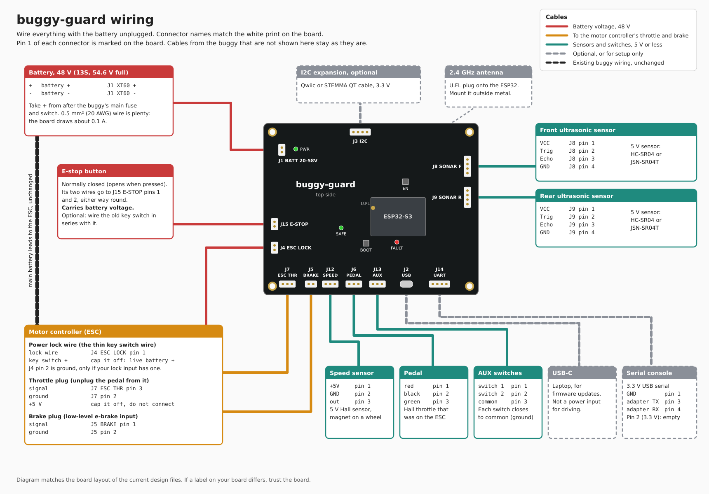

# Installing buggy-guard

buggy-guard sits between the throttle and the motor controller (ESC) of an electric scooter,
buggy or ride-on car. The throttle (a pedal, thumb or twist grip) plugs into the board, the board
drives the ESC's throttle, brake and power lock, and the battery's main leads to the ESC stay as
they are. It can also talk to the ESC over CAN or serial, and switch lights and a horn.

## Before you start

- The board runs from 12 V to 60 V packs: 3S to 16S lithium (67.2 V fully charged), or a
  12 V to 48 V lead acid bank. It starts at 9 V. Do not use a 17S or larger pack.
- Unplug the battery before connecting anything.
- The brake output is a contact, like a second brake lever switch. It works with both low-level
  e-brake inputs (the lever shorts the brake wire to ground) and high-level ones (the lever
  connects it to a 5 V or 12 V brake supply).
- You need a multimeter, JST XH crimp housings (2.5 mm) for the small connectors, and a
  normally closed e-stop button.

## Connectors

The names match the white print on the board. Pin 1 is marked next to each connector.

| Connector | Pin 1 | Pin 2 | Pin 3 | Pin 4 |
|---|---|---|---|---|
| J1 BATT 12-60V (XT60) | battery - (chamfered side) | battery + | | |
| J15 E-STOP (JST XH) | e-stop button | e-stop button | | |
| J4 ESC LOCK (JST XH) | ESC power lock wire | ground, usually empty | | |
| J7 ESC THR (JST XH) | empty | ESC throttle ground | ESC throttle signal | |
| J5 BRAKE (JST XH) | ESC brake signal | ESC brake ground or brake supply | | |
| J6 PEDAL (JST XH) | throttle red (+5 V) | throttle black | throttle green (signal) | |
| J12 SPEED (JST XH) | sensor +5 V | sensor ground | sensor output | |
| J13 AUX (JST XH) | switch 1 | switch 2 | common (ground) | |
| J8 SONAR F (JST XH) | VCC | Trig | Echo | GND |
| J9 SONAR R (JST XH) | VCC | Trig | Echo | GND |
| J14 UART (JST XH) | GND | 3.3 V out, leave empty | adapter TX | adapter RX |
| J3 I2C (Qwiic) | GND | 3.3 V | SDA | SCL |
| J16 CAN (JST XH) | CANH | CANL | GND | |
| J17 ESC UART (JST XH) | GND | ESC TX | ESC RX | |
| J18 LIGHTS (JST XH) | load supply + | light or horn 1 - | light or horn 2 - | light or horn 3 - |

Throttle wire colours vary between makers. If yours differ, find +5 V and ground with a meter on
the ESC's throttle plug before you unplug the throttle.

## Step by step

1. **Mount the board.** Four M3 holes, 112 x 72 mm apart. Put it in a box out of the rain, away
   from the motor phase wires.
2. **Battery.** Make a lead with a female XT60 on it and run it to J1 from the ESC's own battery
   terminals, not from the battery. The board's ground also reaches the ESC through the throttle
   and brake plugs, so if the lead's - went to the battery instead, motor current would share the thin signal grounds and offset
   the throttle. Taking + at the ESC also puts it after the vehicle's main fuse and switch.
   0.5 mm² (20 AWG) wire is enough on its own; the board draws about 0.1 A. If J18 drives lights
   or a horn, their current comes back through this lead, so use 1.5 mm² (16 AWG) and keep it
   short. Cable tie the lead to the frame close to the plug so vibration cannot work it out.
3. **Power lock.** Most ESCs have a key switch with two wires: a thick one that is always at
   battery voltage, and a thin lock wire that turns the ESC on. Find them with the meter: with
   the battery connected and the key off, the lock wire reads 0 V. Unplug the battery again,
   cut the key switch out, connect the lock wire to J4 pin 1, and insulate the other wire well.
   It is live battery + whenever the battery is connected.
4. **E-stop.** Wire a normally closed e-stop button to J15, either way round. It carries
   battery voltage. If you want to keep the old key switch, wire it in series with the e-stop.
5. **Throttle.** Unplug the throttle from the ESC and plug it into J6. Wire the ESC's
   throttle plug to J7: signal to pin 3, ground to pin 2. Leave the ESC's throttle +5 V wire
   unconnected and insulated.
6. **Brake.** Wire J5 in parallel with the brake lever switch, so either can brake. Pin 1 goes to
   the ESC's brake signal. For a low-level brake input pin 2 goes to the brake ground; for a
   high-level one it goes to the wire the lever switch connects the signal to (5 V or 12 V). The
   contact takes up to 60 V and 100 mA.
7. **Ultrasonic sensors.** A 5 V HC-SR04 or JSN-SR04T on J8 (front) and J9 (rear). Their pin
   order is the same as the connector, so a straight cable works.
8. **Speed sensor.** A 5 V Hall sensor on J12, with a magnet on a wheel. J8, J9 and J12 share a
   200 mA supply.
9. **AUX switches** (optional). Each switch goes from J13 pin 1 or pin 2 to pin 3. What they do
   is set in the firmware.
10. **Antenna.** Clip a 2.4 GHz U.FL antenna onto the socket on the ESP32 module. Mount the
    antenna outside any metal and away from the motor and battery wires.
11. **CAN** (optional). For an ESC with a CAN port (VESC, some Fardriver and Kelly models), wire
    CANH, CANL and ground to J16. If the board is at one end of the bus, bridge solder jumper JP1
    next to J16 to switch in the 120 ohm terminator.
12. **ESC serial** (optional). The ESC's TX goes to J17 pin 2, its RX to pin 3, ground to pin 1.
    The port runs at 3.3 V as made. For a 5 V ESC port, cut the trace between pads 1 and 2 of
    JP2 and bridge pads 2 and 3.
13. **Lights and horn** (optional). Connect the supply for them to J18 pin 1: the battery +, or
    the + of a 12 V converter whose - is on the battery -. Each light or horn goes between that
    supply and its own wire on J18 pins 2 to 4. The board switches the - side. Up to 60 V and 2 A
    per output.

USB-C is for loading firmware from a laptop. It does not power the vehicle for driving.

## Fardriver ND72240

The ND72240 is a 72 V series controller, so a few settings have to change for a smaller pack
and for the board's throttle. The values below are for a 48 V (13S) pack. Wire colours and pin
numbers are from the Fardriver manual's 30-pin table; check them against the label on your
harness.

| ND72240 wire | Colour | 30-pin | Goes to |
|---|---|---|---|
| Electric key lock (KEY) | orange | 11 | J4 ESC LOCK pin 1 |
| Throttle signal (SV) | green and white | 14 | J7 ESC THR pin 3 |
| Throttle ground | black | 24 | J7 pin 2 |
| Throttle power (ACC+) | red and white | 23 | not connected, insulate it |
| Low brake (BL) | yellow and green | 20 | J5 BRAKE pin 1 |
| Low brake ground | black | 18 | J5 pin 2 |
| High brake (BH) | grey | 19 | not connected (or J5 pin 1, with pin 2 on the brake supply, if you use high brake) |
| Anti-theft power + | pink and red | 2 | not connected |

Leave the anti-theft power wire unconnected. The key lock must be the only thing that can turn
the controller on, or the board cannot switch it off.

In the Fardriver app:

- **Rated voltage** 48 V, and **undervoltage** to suit a 13S pack, about 42 V. A 72 V series
  controller ships with a 63 V undervoltage point and will not drive on a 48 V pack.
- **Throttle low threshold** 0.5 V. The board idles the throttle at 0 V.
- **Throttle high threshold** 4.0 V. The controller treats anything above the high threshold
  plus 0.6 V as a broken throttle, and the board's firmware caps its output at 4.2 V.
- **Low brake** set to "hanging driving and GND parking": drive while the wire floats, brake
  when it is grounded. The other setting inverts it, and the brake would stay on.
- **Gear mode** "default forward", unless you wire your own forward and reverse switch to the
  controller's FW and RE wires.
- If the controller reports a throttle fault whenever the board is disarmed, turn **lost
  throttle alarm** off. The board holds the throttle at 0 V when it is not armed.

The ND72240 only runs while the board is armed. When the board trips or the e-stop opens, the
controller loses power and cannot regen brake, so the vehicle coasts. Make sure its mechanical
brakes work.

CAN and serial are optional with the ND72240; the throttle, brake and lock wiring above is all
it needs.

## First power-up

Lift the driven wheels off the ground first.

1. Connect the battery. The green PWR LED comes on. The green SAFE LED stays off, and the ESC
   stays off: with a Fardriver, the app cannot find it over Bluetooth.
2. Open the throttle. The motor must not turn: the board holds the throttle at zero and the
   brake on until the firmware arms it.
3. Press the e-stop. The ESC must switch off. Release it.
4. Arm the board from the remote. SAFE comes on, and the throttle now drives the motor.
5. Take the remote out of range, or press the e-stop, and check the motor stops.

If the ESC does not switch on through J4, measure the current its lock wire draws through the
old key switch. It should be under 0.3 A. Some ESCs charge a capacitor through it; the board's
1 A fuse also feeds the board itself.
